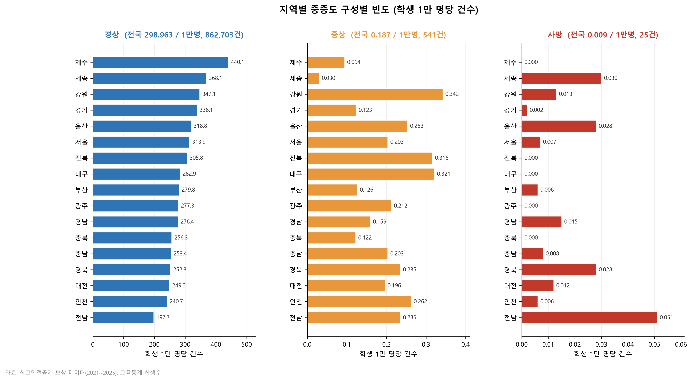
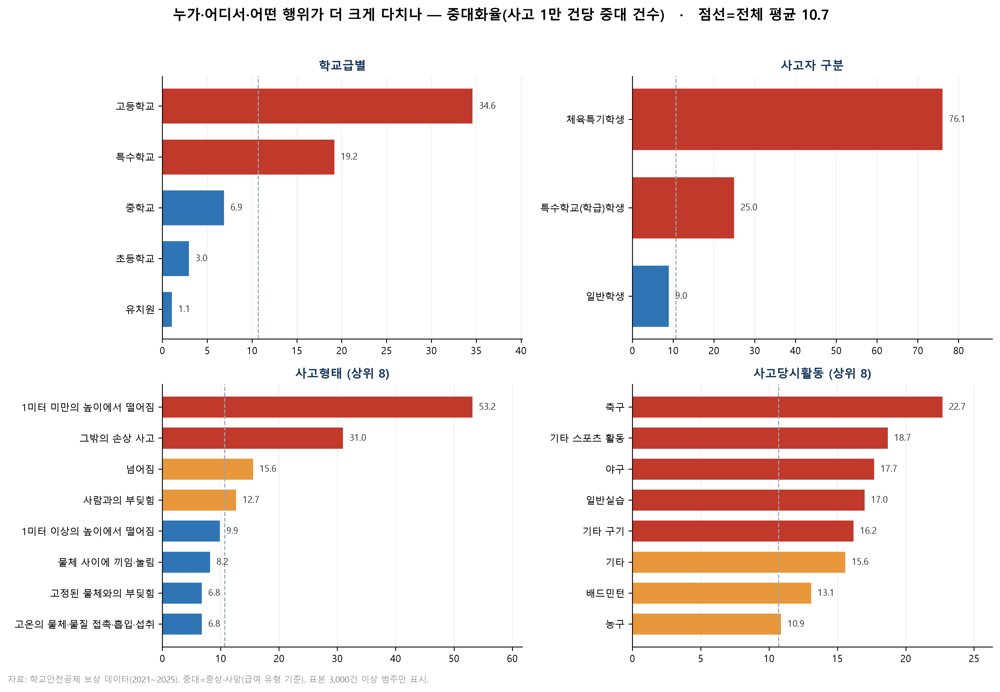
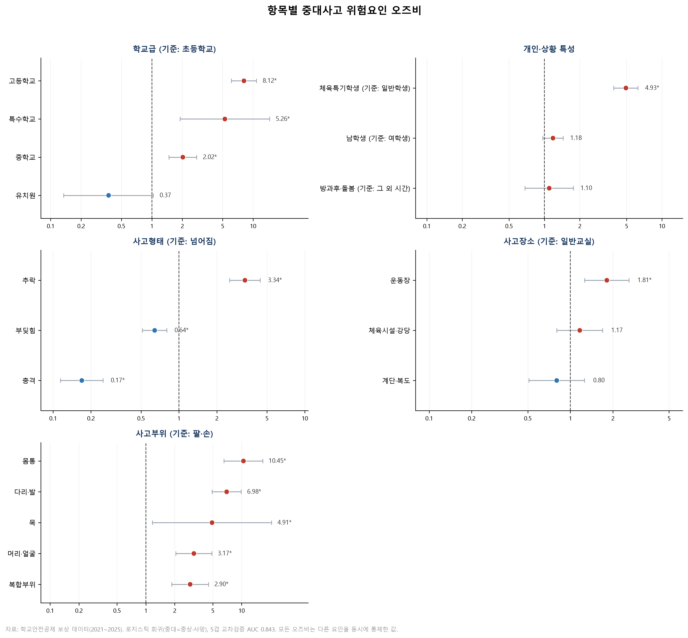
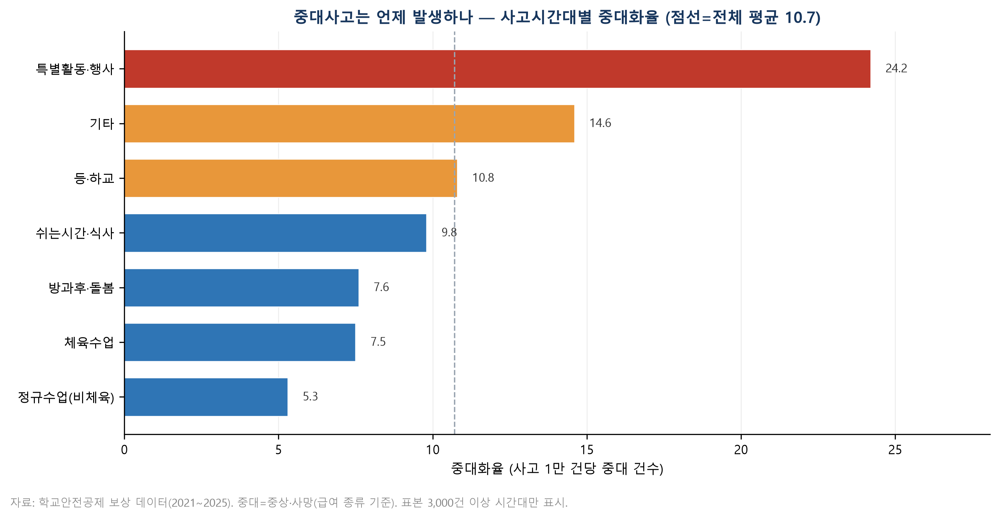

# 학교 중대사고 위험요인 및 지역 격차 분석

**2026 학교안전사고 데이터 분석 활용 경진대회 출품작**을 포트폴리오용으로 정리한 저장소입니다. 2021~2025년 학교안전사고를 단순 사고 건수나 보상금이 아닌 **중증도(경상·중상·사망)** 관점에서 분석하고, 사고가 중대화되는 집단·장소·행위·시간대와 지역 격차를 탐색했습니다.

> 작품명: 학교안전사고, 얼마나 자주가 아니라 얼마나 크게

## 프로젝트 개요

- 분석 대상: 2021~2025년 학교안전사고 및 보상 데이터
- 보조 자료: 한국교육개발원 교육통계의 지역별 학생 수
- 핵심 질문: 누가, 어디서, 언제, 어떤 상황에서 사고가 중대사고로 이어지는가
- 분석 방법: 중대화율 산출, 지역별 빈도 비교, 로지스틱 회귀, 5겹 교차검증
- 활용 기술: Python, pandas, NumPy, statsmodels, scikit-learn, Matplotlib

## 핵심 결과

- 지급자료 약 52.8만 건 중 중대사고는 566건이며, 전체 중대화율은 사고 1만 건당 10.7건으로 나타났습니다.
- 사고가 자주 발생한 지역과 중상·사망 위험이 높은 지역은 일치하지 않았습니다.
- 고등학교, 특수학교, 체육특기학생, 추락, 운동장 사고에서 중대화 위험이 높았습니다.
- 특별활동·행사 시간의 중대화율은 사고 1만 건당 24.2건으로 전체 평균의 두 배를 넘었습니다.
- 다변량 로지스틱 회귀 모델의 5겹 교차검증 AUC는 0.843이었습니다.
- 고위험 조건을 결합한 페르소나의 예측 중대화 확률은 약 17.3%로, 전체 평균의 약 162배였습니다.

## 주요 시각화

### 지역별 사고 빈도와 중증도



### 집단 및 행위별 중대화율



### 중대사고 위험요인 오즈비



### 사고시간대별 중대화율



## 저장소 구성

```text
src/              분석 및 시각화 코드
results/figures/  보고서에 사용한 대표 시각화 4종
METHODOLOGY.md    데이터 정의, 분석 절차, 해석상 주의사항
requirements.txt  실행에 필요한 Python 패키지
```

## 실행 방법

```bash
pip install -r requirements.txt
```

경진대회 제공 원자료와 교육통계 파일을 `src/data/`에 배치한 뒤 아래 순서로 실행합니다.

```bash
python src/analysis.py
python src/make_severity.py
python src/make_frequency.py
python src/make_freq_severity.py
python src/make_risk_model.py
python src/make_or_panels.py
python src/make_report_assets.py
```

## 데이터 공개 범위

경진대회 제공 원자료와 교육통계 원본, 가공·집계 데이터 및 모델 결과표는 공개 저장소에 포함하지 않았습니다. 공개본에는 분석 코드, 방법론 설명, 데이터 값을 직접 복원할 수 없는 대표 시각화만 수록했습니다.

## 해석상 주의사항

이 분석은 관찰 데이터에 기반한 연관성 분석이며 인과관계를 의미하지 않습니다. 사고 데이터와 보상 데이터에는 공통 사건 식별자가 없어 사건 단위로 연결하지 않았고, 사망과 중상은 소표본이므로 지역·세부 범주의 순위는 확정적 결론보다 정밀 점검을 위한 신호로 해석해야 합니다.
